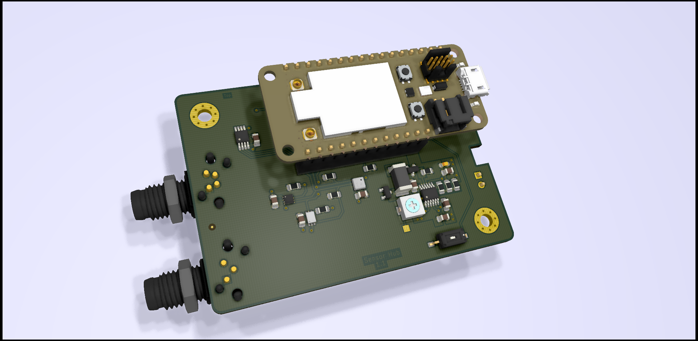
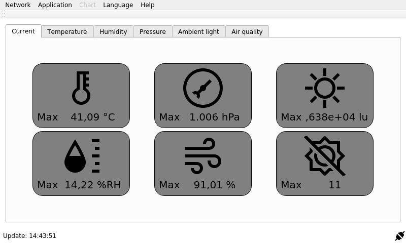

# SensorHub

## Table of Contents

- [SensorHub](#sensorhub)
  - [Table of Contents](#table-of-contents)
  - [About](#about)
  - [Image sources](#image-sources)
  - [Setup](#setup)
  - [Device modes](#device-modes)
  - [Bluetooth](#bluetooth)
  - [Measurement](#measurement)
  - [History](#history)
  - [Maintainer](#maintainer)

## About

Solar-powered, low energy environment sensor node with WiFi interface. The device will measure the following parameter:

- Temperature (with a [MCP9808](http://ww1.microchip.com/downloads/en/DeviceDoc/25095A.pdf))
- Humidity (with a [BME680](https://www.bosch-sensortec.com/media/boschsensortec/downloads/datasheets/bst-bme680-ds001.pdf))
- Pressure (with a [BME680](https://www.bosch-sensortec.com/media/boschsensortec/downloads/datasheets/bst-bme680-ds001.pdf))
- Gas resistance (with a [BME680](https://www.bosch-sensortec.com/media/boschsensortec/downloads/datasheets/bst-bme680-ds001.pdf))
- Ambient light (with a [BH1726](https://fscdn.rohm.com/en/products/databook/datasheet/ic/sensor/light/bh1726nuc-e.pdf))
- UV (with a [VEML6070](https://www.vishay.com/docs/84277/veml6070.pdf))

The whole device is designed for low power operation and for a solar panel as current source. A backup battery will be used to buffer the sun-free time during the night or on cloudy days.
This battery will be charged by an integrated solar-charging circuit.



The integrated WiFi is used to transmit the data as an [MQTT](http://mqtt.org/) message to a broker (i. e. a Raspberry Pi). The included Qt application for the Raspberry Pi can be used to visualize and record the received data.



## Image sources

- [Language Icons](https://www.iconfinder.com/iconsets/flags_gosquared)
- [Icons8](https://icons8.com/icon/set/database/material)
- [Qt project](https://www.qt.io/blog/2016/06/20/introducing-new-built-with-qt-logo)

## Setup

- You have to use the [Particle CLI](https://docs.particle.io/reference/developer-tools/cli/) or the [Particle App](https://play.google.com/store/apps/details?id=io.particle.android.app&hl=de) to setup your WiFi credentials in the microcontroller module before you can use the software.

```bash
$ particle usb start-listening
Done.

$ particle serial wifi
? Should I scan for nearby Wi-Fi networks? (Y/n) y
? Should I scan for nearby Wi-Fi networks? Yes
? SSID ...
? SSID ...
? Security Type (Use arrow keys)
? Security Type ...
? Cipher Type (Use arrow keys)
? Cipher Type ...
? Wi-Fi Password ...
? Wi-Fi Password ...
Done! Your device should now restart.
```

- Download a bluetooth app for your smartphone (i. e. [nRF Connect](https://play.google.com/store/apps/details?id=no.nordicsemi.android.mcp&hl=de)).
- Make sure that your microcontroller module runs at least firmware version [1.5.2](https://github.com/particle-iot/device-os/releases/tag/v1.5.2).
- **Optional:** Build the firmware from the soures in `software/SensorHub` by using [Visual Studio Code](https://code.visualstudio.com/) and the [Particle Workbench](https://www.particle.io/workbench/).
- Power up the `SensorHub` and flash the firmware from `software/release` by using the [Particle CLI](https://docs.particle.io/tutorials/developer-tools/cli/#flashing-over-serial-for-the-electron).
- Hold the `MODE` button of the microcontroller module to enter the setup mode.
- After entering the setup mode the RGB LED of the device will lights up red.
- Open the app and connect your smartphone with the `SensorHub`. When the connection is successful the RGB LED of the `SensorHub` starts to blink green until you close the connection or a IP address of the MQTT broker was transmitted successfully.

## Device modes

The `SensorHub` use the RGB led of the microcontroller module to display his current state. Each state is encoded in a blink pattern which begins with a **3 seconds** group color.

| **RGB color** | **Group** |
|:-------------:|:---------:|
| Blue          | Sensors   |
| Green         | Network   |
| Red           | Device    |

The group color is followed by the error code which is encoded with a white flashing of the RGB LED. Each flash has a duration of **1 second**.

| **Blink code** | **Sensors** | **Network** | **Device** |
|:--------------:|:------------------------------------------:|:-----------:|:-----------:|
| 1x             | Temperature sensor failure. | No valid WiFi credentials found. <br> Please use the [Particle CLI](https://docs.particle.io/reference/developer-tools/cli/) to setup your WiFi credentials. | - |
| 2x             | Light sensor failure. | No valid IP address found. | - |
| 3x             | Environment sensor failure. | Connection error. | - |
| 4x             | UV sensor failure. | Network timeout. | - |
| 5x             | Communication error. | - | - |

The current device error is also printed over the serial interface of the microcontroller module or is published over the MQTT tag `sensorhub/errors` (this required valid network settings).

## Bluetooth

The firmware use the following UUIDs for the bluetooth low energy service:

| **UUID** | **Description** |
|:------------------------------------:|:---------:|
| b4250401-fb4b-4746-b2b0-93f0e61122c6 | General service UUID for the BLE service. |
| b4250402-fb4b-4746-b2b0-93f0e61122c6 | Server IP UUID to configure the IP address of the MQTT server. |

## Measurement

After a successful configuration and initialization the device will enter the sleep mode. The microcontroller is woken up every three minutes to read in new data from the sensors. After a successful read of the
sensors the data gets packed in a [JSON](https://www.json.org/json-en.html) structure and published by using the [MQTT](http://mqtt.org/) protocol. The firmware uses the topic `sensorhub/weather` to publish the sensor data in the network.
The JSON object uses the following structure:

```json
{
  "Temperature": "23.0",
  "Ambient light": "1000.0",
  "UV": "7",
  "Pressure": "1004",
  "Humidity": "44.0",
  "Gas resistance": "20000",
  "Gas valid": "0",
  "IAQ": "97.5",
  "IAQ valid": "0",
  "Voltage": "1.2"
}
```

| **Element**    | **Description** |
|:--------------:|:---------------:|
| Temperature    | Temperature as float in °C. |
| Ambient light  | Illuminance as float in lux. |
| UV             | UV-A index as byte in the range of 0 to 11. |
| Pressure       | Air pressure as float in hPa. |
| Humidity       | Humidity as float in %RH. |
| Gas resistance | Gas resistance as float in Ohms. |
| Gas valid      | Boolean flag to indicate a valid gas measurement. |
| IAQ            | [Indor Air Quality](https://en.wikipedia.org/wiki/Indoor_air_quality) in %. |
| IAQ valid      | Boolean flag to indicate a valid IAQ index. |
| Voltage      | Solar cell voltage as float in V. |

## History

| **Version**   | **Description** | **Date**   |
|-------------|---------------------------------------------|----------|
| 0.1           | Release hardware version 1.1 <br> Firmware version 1.0 <br> Release application version 1.0               | 13.07.2020 |

## Maintainer

- [Daniel Kampert](mailto:DanielKampert@kampis-elektroecke.de)
